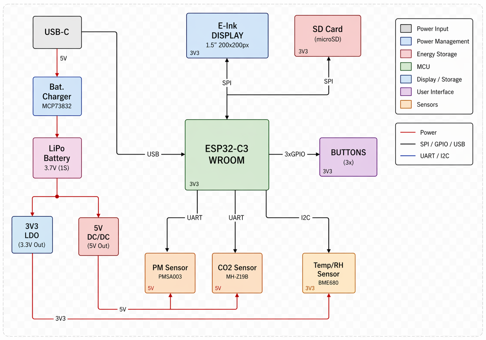

# Proiect InkTime - ESP32-C3 Smartwatch

Acest document contine specificatiile tehnice, Bill of Materials (BOM) si detaliile de design pentru proiectul InkTime.

## 1. Diagrama Bloc

# 2. Bill Of Materials (BOM)

Fisierul complet BOM poate fi gasit aici:

[bom.csv](Manufacturing/bom.csv)

# 3. Functionalitati Hardware

## Descrierea Detaliata a Functionalitatii Hardware

Proiectul InkTime este un smartwatch open-source proiectat in jurul unei arhitecturi compacte, cu accent pe integrare mecanica buna, consum redus de energie si posibilitatea de productie. Sistemul include un microcontroller cu conectivitate wireless, un subsistem de alimentare cu baterie reincarcabila, o interfata de afisare de tip e-paper, butoane pentru interactiunea utilizatorului si circuite de test si programare pentru dezvoltare si depanare.

Arhitectura hardware este organizata modular, astfel incat fiecare bloc functional sa poata fi rutat clar pe PCB si integrat in carcasa dispozitivului fara a compromite semnalul, alimentarea sau accesul la interfetele externe.

### 1. Unitatea centrala de procesare

* **nRF52840** reprezinta elementul central al sistemului si coordoneaza functionarea intregului dispozitiv.
* Acest circuit integreaza:
  * nucleul principal de procesare
  * comunicatia wireless Bluetooth Low Energy
  * controlul perifericelor externe
  * interfetele de programare si debug

### Rolul microcontrollerului

Microcontrollerul are urmatoarele responsabilitati principale:

* gestioneaza comunicatia cu display-ul
* citeste intrarile venite de la butoane
* controleaza actualizarile interfetei grafice
* permite transfer de date si depanare prin interfata USB si SWD
* coordoneaza starile de functionare active si low-power ale sistemului

Prin utilizarea unui SoC cu radio integrat, complexitatea placii este redusa, iar spatiul ocupat pe PCB este optimizat.

### 2. Managementul puterii

Subsistemul de alimentare a fost proiectat astfel incat dispozitivul sa poata functiona dintr-o baterie LiPo reincarcabila si sa poata fi incarcat prin USB-C.

Blocul de alimentare include:

* **port USB-C** pentru alimentare si incarcare
* **circuit de incarcare pentru bateria LiPo**
* **stabilizare si filtrare a tensiunilor de alimentare**
* **distributie separata a liniilor de alimentare**
* **test pad-uri pentru VBAT, 3V3, GND si alte semnale importante**

### Rolul subsistemului de alimentare

* permite alimentarea dispozitivului din USB
* permite incarcarea bateriei interne
* asigura tensiunea necesara pentru microcontroller si periferice
* reduce zgomotul electric prin condensatoare de decuplare plasate local
* permite masurare si depanare prin puncte de test dedicate

In layout-ul PCB se observa ca traseele de alimentare sunt rutate separat fata de semnalele de date, iar planurile de masa contribuie la stabilitate si la reducerea interferentelor.

### 3. Interfata de afisare

Dispozitivul foloseste un **display e-paper**, conectat printr-un conector dedicat de tip FPC.

### Avantajele acestei alegeri

* consum redus de energie
* vizibilitate buna in lumina ambientala
* pastrarea imaginii pe ecran fara consum continuu
* potrivit pentru un smartwatch orientat spre autonomie

### Rol hardware

* display-ul este controlat de microcontroller printr-o interfata digitala dedicata
* liniile suplimentare de control sunt folosite pentru selectie, reset, date/comenzi si semnal de stare
* conectorul FPC permite integrarea mecanica usoara in ansamblul final

### 4. Interfata utilizator

Interfata fizica cu utilizatorul este realizata printr-un set de **butoane tactile**, amplasate astfel incat sa se alinieze cu elementele mecanice ale carcasei.

### Rolul butoanelor

* navigare in meniu
* confirmare/selectie
* control al functiilor principale ale dispozitivului

Din punct de vedere hardware, aceste butoane sunt conectate la pini GPIO ai microcontrollerului si pot genera evenimente de tip intrerupere, ceea ce permite o functionare eficienta energetic.

### 5. Programare, debug si testare

Pentru dezvoltare si validare, placa include:

* interfata **SWD**
* puncte de test marcate pe silkscreen
* semnale expuse pentru:
  * SWDIO
  * SWCLK
  * RESET
  * GND
  * 3V3
  * VBAT
  * alte semnale utile in laborator

### Avantaje

* programare usoara a firmware-ului
* depanare rapida in timpul dezvoltarii
* verificare electrica a surselor si semnalelor
* suport bun pentru etapa de review si productie

Prezenta acestor puncte de test este importanta atat pentru debugging, cat si pentru verificarea functionala a placii.

### 6. Conectivitate wireless

Comunicatia wireless este asigurata de transceiverul radio integrat in nRF52840, impreuna cu antena dedicata de 2.4 GHz.

### Consideratii de proiectare RF

* antena este amplasata spre marginea placii
* zona din jurul antenei trebuie mentinuta cat mai libera de cupru si trasee
* retea de adaptare RF este utilizata pentru potrivirea impedantei
* planul de masa este controlat atent in zona radio

Aceste aspecte sunt esentiale pentru obtinerea unei performante bune a semnalului Bluetooth.

### 7. Protectie si componente pasive

Pentru functionare stabila si robusta, placa include:

* condensatoare de decuplare plasate cat mai aproape de pini de alimentare
* diode si componente de protectie pe liniile critice
* filtrare locala pentru reducerea zgomotului
* trasee scurte in jurul circuitelor importante
* via stitching intre planurile de masa

Aceste masuri contribuie la:

* stabilitatea alimentarii
* imunitate mai buna la zgomot
* comportament predictibil la incarcare si transmisie radio
* usurinta in validarea DRC/ERC

## Analiza Consumului de Energie si Autonomie

Proiectul InkTime este gandit ca un dispozitiv portabil, deci consumul de energie este un criteriu important. Estimarea autonomiei depinde de mai multi factori:

* timpul petrecut in sleep
* frecventa actualizarilor display-ului
* utilizarea comunicatiei Bluetooth
* activitatea butoanelor si a perifericelor
* eficienta regulatorului si pierderile pe alimentare

### 1. Componente cu impact major in consum

| Modul / Componenta | Standby / Sleep | Operare activa |
| :--- | :--- | :--- |
| **nRF52840** | foarte redus, in functie de modul low-power | consum mai mare in procesare si BLE |
| **Display e-paper** | aproape zero pentru imagine statica | consum doar la refresh |
| **Circuite de alimentare** | consum propriu redus | depinde de sarcina |
| **Butoane / GPIO** | neglijabil | impulsuri scurte |

### 2. Scenariu de utilizare tipic

Un scenariu realist pentru InkTime presupune:

* majoritatea timpului in sleep
* trezire periodica pentru actualizare
* refresh rar al display-ului
* utilizare ocazionala a Bluetooth
* interactiuni scurte prin butoane

In acest mod de functionare, consumul mediu poate ramane redus, iar autonomia creste semnificativ fata de un dispozitiv cu ecran activ permanent.

### 3. Estimare autonomie

Autonomia depinde direct de:

* capacitatea bateriei LiPo folosite
* consumul mediu rezultat din duty cycle
* frecventa comunicarilor wireless
* numarul de refresh-uri ale display-ului

Formula generala utilizata este:

`Autonomie (ore) = Capacitate baterie (mAh) / Consum mediu (mA)`

Deoarece autonomia exacta depinde de firmware si de scenariul real de utilizare, aceasta trebuie validata experimental pe prototipul fizic.

# 4. Alocare pini si interfete hardware

## 1. Alimentare

### Semnale principale

* VBAT
* 3V3
* GND
* VBUS

### Rol

* **VBAT** alimenteaza sistemul din bateria LiPo
* **VBUS** vine din portul USB-C
* **3V3** alimenteaza logica digitala si microcontrollerul
* **GND** reprezinta referinta comuna a intregului sistem

### Observatii

* semnalele de alimentare sunt scoase si in test pad-uri
* traseele de alimentare sunt rutate mai lat decat semnalele de date
* condensatoarele de decuplare sunt plasate aproape de componentele active

## 2. Interfata RF

### Blocuri implicate

* iesirea RF a microcontrollerului
* reteaua de adaptare
* antena de 2.4 GHz

### Rol

* transmite si receptioneaza semnalul Bluetooth
* asigura conectivitate wireless pentru smartwatch

### Observatii de proiectare

* antena este pozitionata la marginea PCB-ului
* sub antena trebuie evitata turnarea de cupru
* traseul RF trebuie pastrat cat mai scurt si controlat

## 3. Oscilatoare

Microcontrollerul foloseste surse de ceas necesare functionarii corecte a sistemului.

### Rol

* stabilitate pentru functionarea nucleului principal
* precizie pentru comunicatia radio
* suport pentru modurile low-power si temporizare

### Observatii

* cristalele si componentele asociate trebuie plasate aproape de pini
* traseele aferente trebuie sa fie scurte si simetrice

## 4. Programare si debug

### Semnale principale

* SWDIO
* SWCLK
* RESET
* GND

### Rol

* programarea firmware-ului
* depanare in timpul dezvoltarii
* testare in laborator

### Implementare pe placa

* semnalele sunt disponibile prin interfata de programare
* exista test pad-uri etichetate clar in silkscreen

## 5. Interfata USB

### Semnale principale

* VBUS
* D+
* D-
* GND

### Rol

* alimentare a dispozitivului
* incarcare a bateriei
* eventuala comunicatie de date, in functie de implementarea firmware

### Protectii

* liniile USB includ protectie ESD
* conectorul USB-C este integrat mecanic in partea superioara a placii

## 6. Interfata display

### Semnale utilizate

In functie de schema, display-ul foloseste o combinatie de semnale de date si control, tipic:

* MOSI
* SCK
* CS
* DC
* RST
* BUSY

### Rol

* transmiterea datelor catre display
* controlul comenzilor de refresh si reset
* citirea semnalului de stare al display-ului

### Implementare

* display-ul este conectat prin conector FPC
* semnalele sunt rutate compact pentru a minimiza zgomotul si interferentele

## 7. GPIO si butoane

### Semnale implicate

* intrari digitale pentru butoane
* eventual semnale de intrerupere

### Rol

* navigare in interfata
* comenzi utilizator
* activare a anumitor functii ale sistemului

### Observatii

* butoanele sunt plasate pentru alinierea cu carcasa
* pot fi utilizate in mod polling sau interrupt-driven

## 8. Test pad-uri si semnale de laborator

Placa include mai multe puncte de test utile pentru validare si depanare, cum ar fi:

* TP_GND
* TP_3V3
* TP_VBAT
* TP_RESET
* TP_SWDIO
* TP_SWCLK
* alte semnale utile din schema

### Avantaje

* diagnostic rapid
* verificarea surselor
* acces usor la semnale fara a modifica traseele principale

## 9. Integrare mecanica

Designul PCB-ului a fost realizat astfel incat:

* sa respecte forma mecanica a carcasei
* sa permita accesul la portul USB-C
* sa alinieze butoanele cu elementele externe
* sa permita montarea display-ului si bateriei in ansamblul final

Forma placii, pozitionarea conectorilor si gruparea functionala a componentelor urmaresc atat cerintele electrice, cat si constrangerile mecanice impuse de produs.